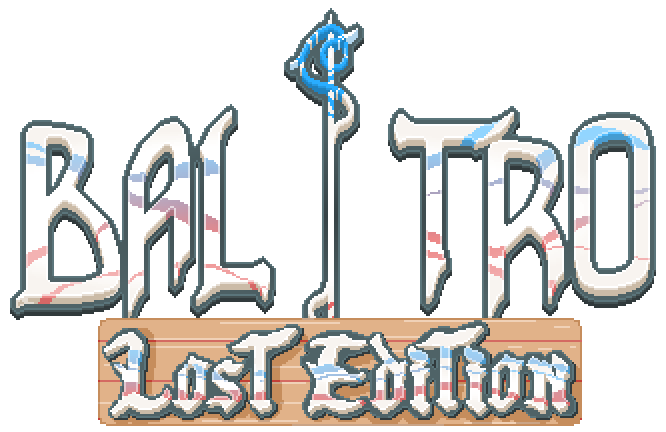

	

# Lost Edition

A massive, fan-made content expansion for Balatro.

Lost Edition is built with love by members of the Balatro modding community. It aims to feel like a natural extension of the base game, with lots of new content to discover and fresh synergies to explore.

## Features
- 75+ new Jokers spread across multiple pages
- 10+ challenging new Boss Blinds
- New Decks, Stakes, Tags, Vouchers, Editions, Enhancements, and Consumables
- New Challenges to test your builds
- Optional themes and color presets
- Original music (toggle between Lost Edition OST and Balatro OST)

## Requirements
Lost Edition requires the following:

- Steamodded ≥ `1.0.0~BETA-0711a`
- Lovely ≥ `0.7`

If these are missing or outdated, the mod will not load correctly.

## Installation
1. Install the required frameworks (Steamodded and Lovely) for Balatro.
2. Download the latest release `.zip` from this mod’s Releases page.
3. Extract the `Lost_Edition` folder from the zip into your Balatro mods directory:
	 - Windows: `%APPDATA%/Balatro/Mods`
4. Launch the game and enjoy!

Important: Avoid using GitHub’s “Download ZIP” of the source/main branch. It may contain WIP content and break your game. Prefer the packaged files in the Releases page.

## Updating
To update safely:
- Close the game.
- Delete the existing `Lost_Edition` folder from `%APPDATA%/Balatro/Mods`.
- Install the new version by repeating the Installation steps above.

## Uninstall
Delete the `Lost_Edition` folder from your `Mods` directory.

## Troubleshooting
- The game crashes or the mod doesn’t load:
	- Verify Steamodded and Lovely meet the minimum versions listed above.
	- Make sure you installed from the Releases page, not a source ZIP.
- Conflicts: If you suspect a mod conflict, try disabling other mods temporarily.

## Community
Join our Discord community for help, discussions, and updates: [https://discord.gg/YWSY9XAguD](https://discord.gg/YWSY9XAguD)

## Credits

**Direction**
- Click no Paulo
- Danitskkj

**Music**
- Gulira

**Artists**
- Click no Paulo
- Wellyson
- Xosé
- Henry
- Roger
- Timba

**Coding**
- Danitskkj
- Ilumino
- Evelyn

**Quality Assurance (Beta Testers)**
- Galves
- Wellyson
- Xosé

**Special Thanks**
- Localthunk for creating this wonderful game!
- The channel subscribers for ideas and support — thank you! ❤️
