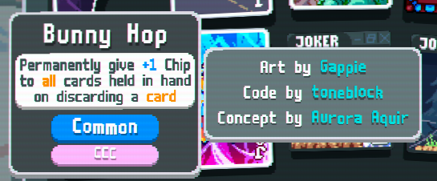

# 3xCredits
A Balatro mod using Steamodded and lovely to add credits to cards and decks.

Made by AuroraAquir.
Also: Localization by TheAlternateDoctor, Bugfix contribution by hayaunderscore

Originally for use in [CelesteCardCollection](https://github.com/AuroraKy/CelesteCardCollection).

Currently supported: Joker Cards, Decks, Vouchers, Tarot Cards, Planet Cards, Spectral Cards, Enhancements, Editions, Boosters

Currently **NOT** supported (Will probably add in the future): Challenges, Blinds, Stickers, Seals

Probably will never be supported: Achievements, Ranks, Suits, Stakes, PokerHands. None of these really have collections to view them at.


To use this mod depend on it in your mod.json by adding "3xCredits (>=1.1~)" to dependencies

Example:
```json
	"dependencies": ["Steamodded (>=1.0.0~BETA-0319c)", "3xCredits (>=1.1~)"]
```

Then when defining a joker or deck add a credits attribute.
If it is defined it will try to find art, code and concept values and all of them should be filled. In CCC we set the value to "N/A" if there is no credit for a field (for example, by it not having art).

Example:
```lua
credit = {
    art = "Gappie",
    code = "toneblock",
    concept = "Aurora Aquir"
},
```

Which could look like this as a full joker definition (from CCC):
```lua
local bunnyhop = {
	name = "ccc_Bunny Hop",
	key = "bunnyhop",
    config = {extra = {chips = 1}},
	pixel_size = { w = 71, h = 81 },
	pos = {x = 9, y = 6},
	loc_txt = {
        name = 'Bunny Hop',
        text = {
			"Permanently give {C:chips}+#1#{} Chip",
			"to {C:attention}all{} cards held in hand",
			"on discarding a {C:attention}card{}",
        }
    },
	rarity = 1,
	cost = 5,
	discovered = true,
	blueprint_compat = true,
	eternal_compat = true,
	perishable_compat = true,
	atlas = "j_ccc_jokers",
	credit = {
		art = "Gappie",
		code = "toneblock",
		concept = "Aurora Aquir"
	}
}
```

and would appear like this in-game:

